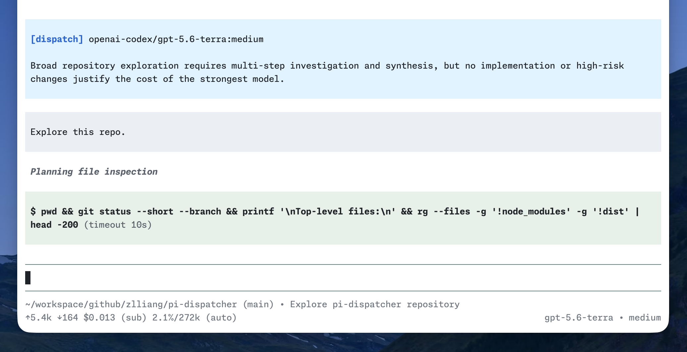

# pi-dispatcher

[Pi](https://pi.dev/) extension that picks the model and thinking level best suited to each session.

pi-dispatcher runs before the first request, asks a dispatcher model to choose from your configured model candidates, then switches Pi to that choice. It considers model capabilities, pricing, your candidate hints, and optional dispatch rules. It dispatches only once, so it doesn’t disrupt your prompt cache.



## Install

Install from npm:

```bash
pi install npm:pi-dispatcher
```

Install from git:

```bash
pi install git:github.com/zlliang/pi-dispatcher
```

## Configuration

pi-dispatcher stays idle until you configure at least one candidate. It reads config from `~/.pi/agent/dispatcher.json` and from the current project's `.pi/dispatcher.json`. Project config overrides matching global fields.

For example:

```json
{
  "dispatcher": {
    "provider": "openai-codex",
    "model": "gpt-5.6-luna",
    "thinkingLevel": "off"
  },
  "candidates": [
    {
      "provider": "openai-codex",
      "model": "gpt-5.6-sol",
      "thinkingLevels": ["high", "xhigh", "max"]
    },
    {
      "provider": "deepseek",
      "model": "deepseek-v4-flash",
      "hint": "Best for fast, cost-effective routine tasks."
    }
  ]
}
```

All fields except each candidate's `provider` and `model` are optional.

| Field | Value | Description |
| --- | --- | --- |
| `dispatcher` | model object | Model used to make the decision. Falls back to the session model when omitted or incomplete. |
| `dispatcher.provider` | string | Dispatcher provider ID. |
| `dispatcher.model` | string | Dispatcher model ID. |
| `dispatcher.thinkingLevel` | thinking level | Defaults to `off`. Unsupported values fall back to the model's lowest available level. |
| `candidates` | candidate array | Models the dispatcher may choose. Empty or omitted disables dispatch. |
| `candidates[].provider` | string | Candidate provider ID. |
| `candidates[].model` | string | Candidate model ID. |
| `candidates[].thinkingLevels` | thinking level array | Allowed levels. Defaults to every level supported by the model. Unsupported levels are clamped and duplicates removed. |
| `candidates[].hint` | string | Guidance on when this candidate is a good choice. |

Valid thinking levels: `off`, `minimal`, `low`, `medium`, `high`, `xhigh`, `max`.

## Dispatch rules

Add personal guidance to `~/.pi/agent/dispatcher.rules.md` and the current project's `.pi/dispatcher.rules.md`. These rules help the dispatcher choose the best model. Global rules are loaded before project ones.

Do not include prices or model specifications in the rules. pi-dispatcher reads them from Pi's model registry.

## Magic instructions

Add a magic instruction anywhere in the first request to control dispatch:

| Instruction | Behavior |
| --- | --- |
| `%keep` or `%model keep` | Keeps the current model and thinking level without calling the dispatcher. |
| `%model <preference>` | Strongly prefers a matching model, optionally with a thinking level, such as `%model sonnet`, `%model gpt-5.6:high`, or `%model openai-codex/gpt-5.6-sol:xhigh`. |

A preference is advisory: the dispatcher may choose differently when capability, risk, dispatch rules, or availability justify it. Model matching is case-insensitive and accepts model-family fragments, so `gpt` and `gpt-5.6` both match `openai-codex/gpt-5.6-sol`; an explicitly requested thinking level must match exactly.

Magic instructions are removed before Pi expands the request, saves the user message, or sends it to the selected model. If a request contains multiple model preferences, the last one wins; a `keep` instruction overrides all preferences.

## How it works

For the first request in a new session, pi-dispatcher:

1. Resolves the configured candidates and their available thinking levels.
2. Sends the candidates, rules, session metadata, optional model preference, and initial request to the dispatcher model.
3. Applies the returned model and thinking level.
4. Adds a dispatch entry to the session with the decision and reason.

Dispatch runs only once per session. A `keep` instruction, missing model, invalid response, timeout, error, or cancellation keeps the current model.
